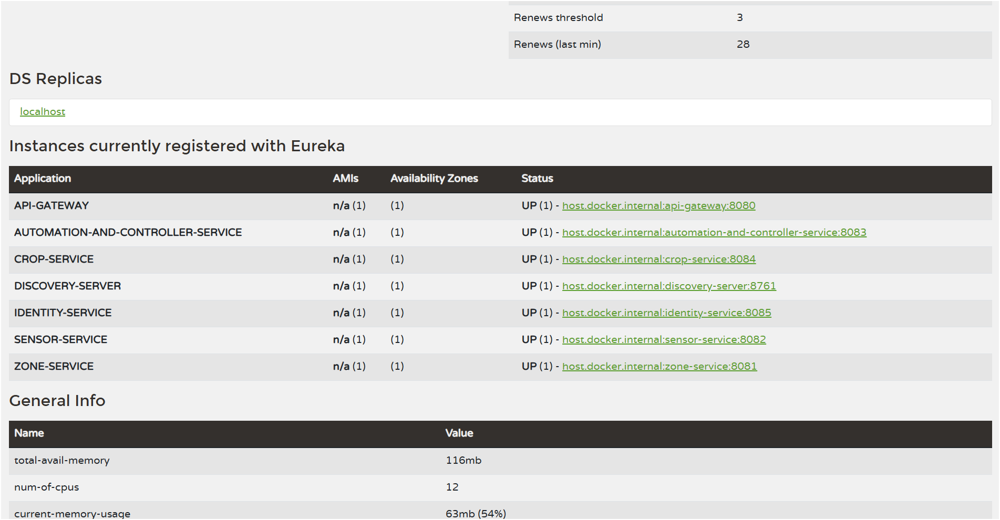
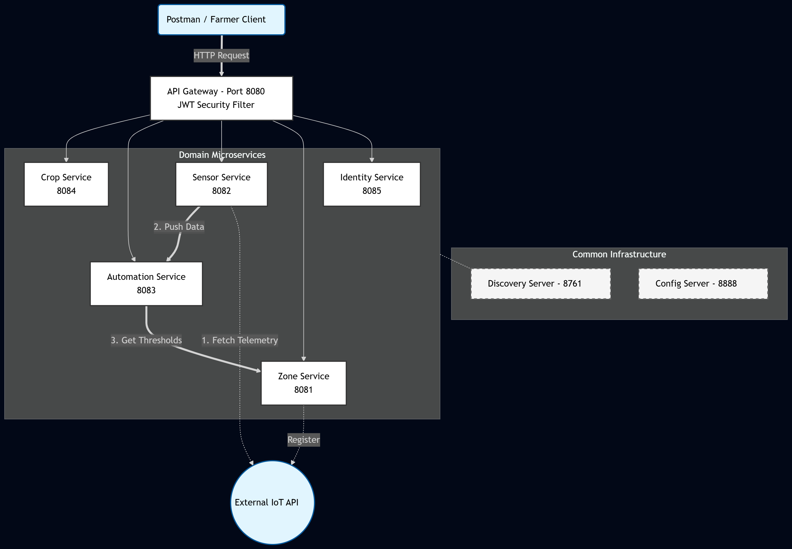

---

# Automated Greenhouse Management System (AGMS)
## Microservice-Based Cloud-Native Application

### Overview
The **Automated Greenhouse Management System (AGMS)** is a distributed system designed to modernize agriculture through precision monitoring and automation. The system utilizes a Microservices Architecture built with **Spring Boot** and **Spring Cloud** to fetch live environmental telemetry from external IoT sensors, process data through a custom rule engine, and manage crop lifecycles.

---

### 🛠 Tech Stack
*   **Backend:** Java 22, Spring Boot 3.5.11
*   **Microservices Orchestration:** Spring Cloud (Eureka, Config Server, API Gateway)
*   **Communication:** RESTful APIs, OpenFeign (Synchronous)
*   **Security:** JWT (JSON Web Tokens) at Gateway Level
*   **Database:** MySQL (Polyglot Persistence approach)
*   **Build Tool:** Maven

---

### 🏗 Architecture Overview

The system consists of **Infrastructure Services** and **Domain Microservices**:

#### 1. Infrastructure Services
| Service | Port | Description |
| :--- | :--- | :--- |
| **Config Server** | 8888 | Centralized configuration management using a Git-based repository. |
| **Discovery Server** | 8761 | Netflix Eureka Service Registry for dynamic service discovery. |
| **API Gateway** | 8080 | Single entry point for clients; handles routing and JWT authentication. |

#### 2. Domain Microservices
| Service | Port | Description |
| :--- | :--- | :--- |
| **Identity Service** | 8085 | Manages user registration and JWT issuance. |
| **Zone Service** | 8081 | Manages greenhouse zones and environment thresholds (Min/Max Temp). |
| **Sensor Service** | 8082 | The "Data Bridge" - Fetches live telemetry every 10s from External IoT APIs. |
| **Automation Service** | 8083 | The "Rule Engine" - Compares telemetry with thresholds and logs actions. |
| **Crop Service** | 8084 | Tracks crop inventory and growth lifecycle (Seedling, Vegetative, Harvested). |

---

### 🚀 Startup Instructions (Sequence Matters!)

To ensure the system starts correctly, follow this exact startup order:

1.  **Start Config Server (8888):** Ensure the `config-repo` is accessible.
2.  **Start Discovery Server (8761):** Wait until the dashboard is accessible at `http://localhost:8761`.
3.  **Start API Gateway (8080):** This is the security layer for all domain services.
4.  **Start Domain Services:** Start `identity-service`, `zone-service`, `sensor-service`, `automation-service`, and `crop-service`.

---

### 🔐 Security & Integration
*   **Gateway Security:** All external requests (Zones, Sensors, Automation, Crops) are intercepted by the Gateway's `AuthenticationFilter`. A valid **Bearer Token** is required to access internal APIs.
*   **External IoT Integration:** The `Sensor Service` integrates with a live Reactive WebFlux IoT API to fetch real-time temperature and humidity data.
*   **Inter-Service Communication:** Uses **OpenFeign** for synchronous calls (e.g., Automation Service fetching thresholds from Zone Service).

---

### 📡 API Endpoints (Quick Reference)

#### 🔑 Identity Service
*   `POST /auth/register` - Register a new user.
*   `POST /auth/login` - Obtain JWT Token.

#### 📍 Zone Management
*   `POST /api/v1/zones` - Create zone and register device to External API.
*   `GET /api/v1/zones` - Fetch all zones.

#### 🌡 Sensor Telemetry
*   `GET /api/v1/sensors/latest` - Returns the last fetched telemetry data for debug view.

#### 🤖 Automation & Control
*   `GET /api/v1/automation/logs` - List all triggered actions (e.g., TURN_FAN_ON).

#### 🌿 Crop Inventory
*   `POST /api/v1/crops` - Register a new crop batch.
*   `PUT /api/v1/crops/{id}/status` - Update lifecycle stage.

---

### 📂 Project Structure & Commits
This project follows a clean service-based folder structure. Development was performed using feature branches (`feature/zone-service`, `feature/sensor-service`, etc.) to maintain a clear and meaningful commit history, ensuring anti-plagiarism and architectural integrity.

---

### 📸 Verification
#### 1. Eureka Service Registry
Below is the screenshot of the Eureka Dashboard showing all 7 services (Infrastructure & Domain) in UP status.

* 

---

### 🏗 System Architecture Diagram

This diagram illustrates the Microservices architecture of the AGMS, showing service registration with Eureka, centralized configuration, and the end-to-end data flow from IoT sensors to automation logic.

---

---
